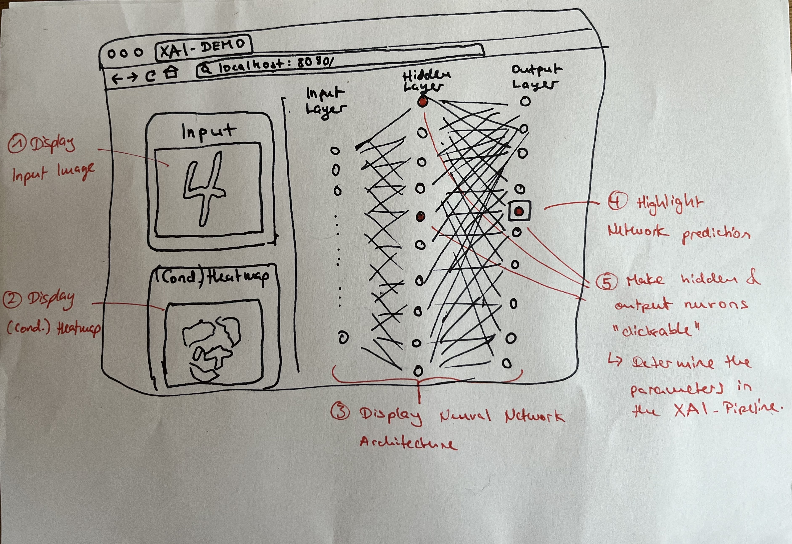

# Build an interactive demonstrator for XAI
This repository contains the coding challenge for the *XAI Demonstrators and Automation* opening at Frauenhofer HHI.

## The Challenge
The goal of this challenge is to closely resemble a typical task you would encounter in this position at HHI.
Your job is to prototype a simple interactive web-application that showcases two XAI-techniques developed at HHI:
- [Layer-wise Relevance Propagation (LRP)](https://www.hhi.fraunhofer.de/en/departments/ai/technologies-and-solutions/layer-wise-relevance-propagation.html) 
- [Concept Relevance Propagation (CRP)](https://www.hhi.fraunhofer.de/en/departments/ai/technologies-and-solutions/concept-relevance-propagation.html).

These two techniques allow to measure the (conditional) relevances a neural network assigns to the individual parts of an input. 


For this demo, a simple feed-forward neural network with one hidden layer should be visualized alongside the input-image, 
the network's prediction, and the corresponding heatmap (see the draft in the image below). 

 

The visualization of the network architecture needs to include at least the neurons from the hidden and output layers. As we can condition the LRP/CRP heatmaps on hidden and output neurons, these should be selectable in your demo by clicking on them. The displayed heatmap should dynamically recompute and update.

### XAI-Backend
For your convenience we provide the code for training and explaining the network in the [examples.ipynb](./demo_and_defaults.ipynb) notebook.
Feel free to use the provided code as part of your backend. Please see [Set up](#set-up:) section below for the details on the required dependencies.

### Expectation
While a polished, production-ready demo is not expected, your demo should be functional and demonstrate your skills. We will discuss your technical and design choices during the interview. Your also should document how to setup and execute your demo in detail and list all required dependencies.
<br><br>
**You are free to choose any frontend frameworks/libraries to create the web-app/demo, and encouraged to ignore any specifications listed if you think it would generate a better visualization.**


## Set up:

For running the [examples.ipynb](./demo_and_defaults.ipynb) you need to have Python 3.11. You can set up a conda environment, for example, with
```bash
conda create --name demo_hhi python=3.11
```

and then install the requirements from `requirements.txt` with `pip` (as some are not available in the usual conda channels):
```bash
pip install -r requirements.txt
```

If you are not familiar with conda, you can also just manually install the dependencies listed.


